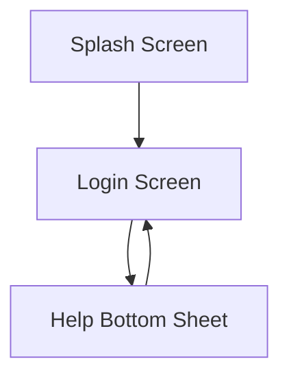

# Learnify LMS Flutter UI Architectural Plan

## Overall App Structure and Navigation Flow

The Learnify LMS app follows a simple Flutter architecture with a MaterialApp as the root, using named routes for navigation. The app starts with a Splash screen, transitions to Login, and includes a Help bottom sheet accessible from Login.

### App Structure

- **lib/**: Main source directory
  - **main.dart**: Entry point with MaterialApp and route definitions
  - **screens/**: Screen widgets (splash_screen.dart, login_screen.dart)
  - **widgets/**: Reusable components (buttons, inputs, bottom_sheets)
  - **theme/**: Theme configuration (theme_data.dart)
  - **utils/**: Constants and helpers (colors.dart, typography.dart)

### Navigation Flow



- Splash Screen: Displays for 2-3 seconds, then navigates to Login.
- Login Screen: Main authentication screen.
- Help Bottom Sheet: Modal overlay from Login for support.

## ThemeData Configuration

The ThemeData is configured to match the design system specifications.

### Colors

```dart
const Color primaryColor = Color(0xFF2C7DA0);
const Color secondaryColor = Color(0xFF4DA8DA);
const Color accentColor = Color(0xFFB9E3F2);
const Color white = Color(0xFFFFFFFF);
const Color lightGray = Color(0xFFF5F7FA);
const Color darkGray = Color(0xFF1F2933);
const Color mediumGray = Color(0xFF6B7280);
const Color borderGray = Color(0xFFE5E7EB);
```

### Typography

Using Inter font family.

```dart
TextTheme textTheme = TextTheme(
  headline1: TextStyle(fontSize: 32, fontWeight: FontWeight.bold, height: 1.2, fontFamily: 'Inter'),
  headline2: TextStyle(fontSize: 24, fontWeight: FontWeight.bold, height: 1.3, fontFamily: 'Inter'),
  headline3: TextStyle(fontSize: 20, fontWeight: FontWeight.w500, height: 1.4, fontFamily: 'Inter'),
  headline4: TextStyle(fontSize: 18, fontWeight: FontWeight.w500, height: 1.4, fontFamily: 'Inter'),
  headline5: TextStyle(fontSize: 16, fontWeight: FontWeight.normal, height: 1.5, fontFamily: 'Inter'),
  headline6: TextStyle(fontSize: 14, fontWeight: FontWeight.normal, height: 1.5, fontFamily: 'Inter'),
  bodyText1: TextStyle(fontSize: 16, fontWeight: FontWeight.normal, height: 1.5, fontFamily: 'Inter'),
  bodyText2: TextStyle(fontSize: 14, fontWeight: FontWeight.normal, height: 1.5, fontFamily: 'Inter'),
  button: TextStyle(fontSize: 16, fontWeight: FontWeight.w500, height: 1.2, fontFamily: 'Inter'),
);
```

### ThemeData

```dart
ThemeData themeData = ThemeData(
  primaryColor: primaryColor,
  scaffoldBackgroundColor: white,
  textTheme: textTheme,
  elevatedButtonTheme: ElevatedButtonThemeData(
    style: ElevatedButton.styleFrom(
      primary: primaryColor,
      onPrimary: white,
      textStyle: textTheme.button,
      minimumSize: Size(double.infinity, 48),
      padding: EdgeInsets.symmetric(horizontal: 16),
      shape: RoundedRectangleBorder(borderRadius: BorderRadius.circular(8)),
    ),
  ),
  outlinedButtonTheme: OutlinedButtonThemeData(
    style: OutlinedButton.styleFrom(
      primary: primaryColor,
      side: BorderSide(color: primaryColor),
      textStyle: textTheme.button,
      minimumSize: Size(double.infinity, 48),
      padding: EdgeInsets.symmetric(horizontal: 16),
      shape: RoundedRectangleBorder(borderRadius: BorderRadius.circular(8)),
    ),
  ),
  textButtonTheme: TextButtonThemeData(
    style: TextButton.styleFrom(
      primary: primaryColor,
      textStyle: textTheme.button,
      minimumSize: Size(double.infinity, 48),
      padding: EdgeInsets.symmetric(horizontal: 16),
    ),
  ),
  inputDecorationTheme: InputDecorationTheme(
    border: OutlineInputBorder(
      borderRadius: BorderRadius.circular(8),
      borderSide: BorderSide(color: borderGray),
    ),
    focusedBorder: OutlineInputBorder(
      borderRadius: BorderRadius.circular(8),
      borderSide: BorderSide(color: secondaryColor),
    ),
    contentPadding: EdgeInsets.all(16),
    hintStyle: TextStyle(color: mediumGray, fontSize: 16),
  ),
);
```

## Component Definitions

### Buttons

- **Primary Button**: Use ElevatedButton with theme styling.
- **Secondary Button**: Use OutlinedButton.
- **Text Button**: Use TextButton.

### Inputs

- **Text Input**: TextFormField with InputDecorationTheme.
- **Password Input**: TextFormField with obscureText and suffix icon.

### Custom Widgets

```dart
class LearnifyButton extends StatelessWidget {
  final String text;
  final VoidCallback onPressed;
  final ButtonType type;

  const LearnifyButton({required this.text, required this.onPressed, required this.type});

  @override
  Widget build(BuildContext context) {
    switch (type) {
      case ButtonType.primary:
        return ElevatedButton(onPressed: onPressed, child: Text(text));
      case ButtonType.secondary:
        return OutlinedButton(onPressed: onPressed, child: Text(text));
      case ButtonType.text:
        return TextButton(onPressed: onPressed, child: Text(text));
    }
  }
}

class LearnifyTextField extends StatelessWidget {
  final String hintText;
  final bool isPassword;

  const LearnifyTextField({required this.hintText, this.isPassword = false});

  @override
  Widget build(BuildContext context) {
    return TextFormField(
      obscureText: isPassword,
      decoration: InputDecoration(
        hintText: hintText,
        suffixIcon: isPassword ? Icon(Icons.visibility_off, color: mediumGray) : null,
      ),
    );
  }
}
```

## Detailed Flutter Widget Structures

### Splash Screen

```dart
class SplashScreen extends StatelessWidget {
  @override
  Widget build(BuildContext context) {
    Future.delayed(Duration(seconds: 3), () {
      Navigator.pushReplacementNamed(context, '/login');
    });

    return Scaffold(
      backgroundColor: accentColor,
      body: Center(
        child: Text(
          'Learnify',
          style: TextStyle(
            fontSize: 48,
            fontWeight: FontWeight.bold,
            color: primaryColor,
            fontFamily: 'Inter',
          ),
        ),
      ),
    );
  }
}
```

### Login Screen

```dart
class LoginScreen extends StatefulWidget {
  @override
  _LoginScreenState createState() => _LoginScreenState();
}

class _LoginScreenState extends State<LoginScreen> {
  final _emailController = TextEditingController();
  final _passwordController = TextEditingController();

  @override
  Widget build(BuildContext context) {
    return Scaffold(
      body: SafeArea(
        child: Padding(
          padding: EdgeInsets.symmetric(horizontal: 24),
          child: Column(
            mainAxisAlignment: MainAxisAlignment.spaceBetween,
            children: [
              Padding(
                padding: EdgeInsets.only(top: 16),
                child: Text(
                  'Learnify',
                  style: Theme.of(context).textTheme.headline2!.copyWith(color: primaryColor),
                ),
              ),
              Expanded(
                child: Column(
                  mainAxisAlignment: MainAxisAlignment.center,
                  children: [
                    LearnifyTextField(hintText: 'Email'),
                    SizedBox(height: 16),
                    LearnifyTextField(hintText: 'Kata Sandi', isPassword: true),
                  ],
                ),
              ),
              Column(
                children: [
                  LearnifyButton(text: 'Masuk', onPressed: () {}, type: ButtonType.primary),
                  SizedBox(height: 16),
                  LearnifyButton(text: 'Bantuan', onPressed: () => _showHelpBottomSheet(context), type: ButtonType.text),
                ],
              ),
            ],
          ),
        ),
      ),
    );
  }

  void _showHelpBottomSheet(BuildContext context) {
    showModalBottomSheet(
      context: context,
      shape: RoundedRectangleBorder(
        borderRadius: BorderRadius.vertical(top: Radius.circular(16)),
      ),
      builder: (context) => HelpBottomSheet(),
    );
  }
}
```

### Help Bottom Sheet

```dart
class HelpBottomSheet extends StatelessWidget {
  @override
  Widget build(BuildContext context) {
    return Container(
      height: MediaQuery.of(context).size.height * 0.7,
      padding: EdgeInsets.all(16),
      child: Column(
        crossAxisAlignment: CrossAxisAlignment.start,
        children: [
          Text('Bantuan', style: Theme.of(context).textTheme.headline3),
          SizedBox(height: 16),
          Row(
            mainAxisAlignment: MainAxisAlignment.spaceBetween,
            children: [
              Text('Bahasa', style: TextStyle(color: mediumGray)),
              Switch(value: true, onChanged: (value) {}),
            ],
          ),
          SizedBox(height: 16),
          Expanded(
            child: SingleChildScrollView(
              child: Column(
                crossAxisAlignment: CrossAxisAlignment.start,
                children: [
                  Text('Pertanyaan Umum', style: Theme.of(context).textTheme.headline4),
                  // Expandable list items
                  Text('Kontak Kami', style: Theme.of(context).textTheme.headline4),
                  // Contact info
                ],
              ),
            ),
          ),
          LearnifyButton(text: 'Hubungi Dukungan', onPressed: () {}, type: ButtonType.secondary),
        ],
      ),
    );
  }
}
```

## UX Reasoning and Flutter Implementation Notes

- **Splash Screen**: Minimalist design reduces load time; Center widget ensures responsiveness. UX: Builds brand recognition without distraction.
- **Login Screen**: Vertical layout with spaceBetween aligns with mobile thumb navigation. Padding and full-width elements optimize for touch. UX: Clear hierarchy focuses on authentication task.
- **Help Bottom Sheet**: Modal keeps user in context; ScrollView handles overflow. UX: Accessible language toggle; structured sections prevent information overload.
- All components use theme for consistency, adhering to 8px grid. Flutter's Material widgets ensure native feel and accessibility.

This plan is ready for direct Flutter development, with all specs integrated.
